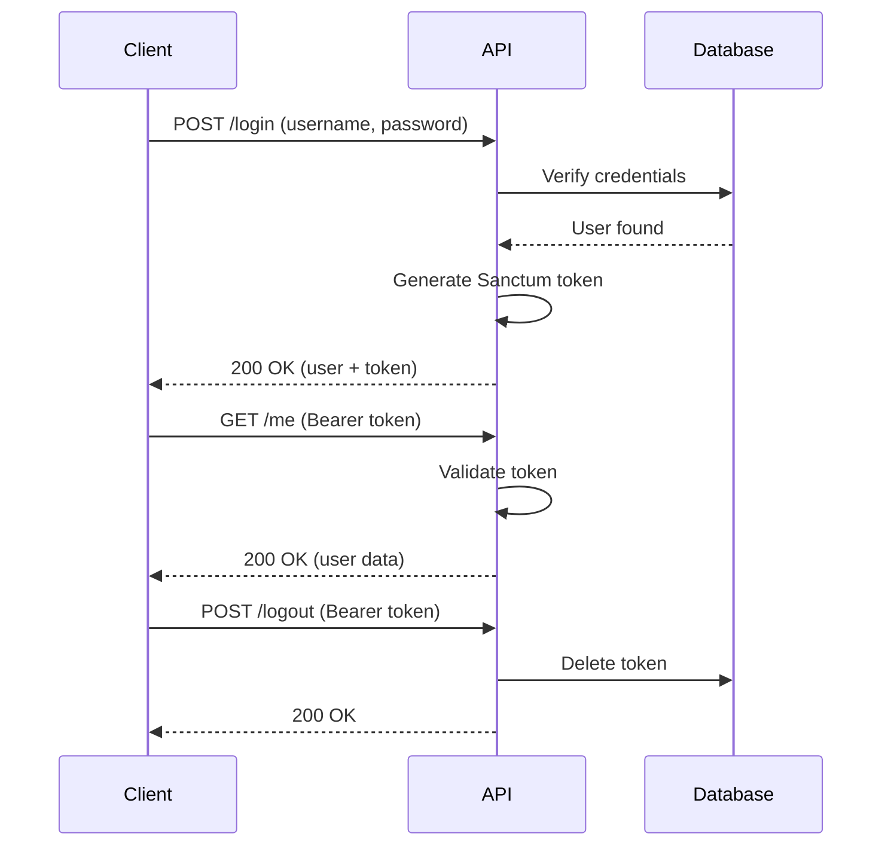

# Authentication API

## Overview

The authentication system uses Laravel Sanctum for token-based authentication. Users authenticate with username/password and receive a Bearer token for subsequent requests.



---

## Endpoints

### Login

Authenticate user and receive access token.

**Endpoint:** `POST /api/v1/login`

**Authentication:** API Token only (no Bearer token required)

**Rate Limit:** 10 requests/minute

#### Request

```json
{
  "username": "admin",
  "password": "password",
  "device_name": "web-browser"
}
```

| Field | Type | Required | Description |
|-------|------|----------|-------------|
| `username` | string | Yes | User's username |
| `password` | string | Yes | User's password (min 6 chars) |
| `device_name` | string | No | Device identifier for token |

#### Response (200 OK)

```json
{
  "success": true,
  "message": "Login successful",
  "data": {
    "user": {
      "uuid": "550e8400-e29b-41d4-a716-446655440000",
      "name": "Admin User",
      "username": "admin",
      "email": "admin@example.com",
      "is_active": true,
      "email_verified_at": "2026-01-01T00:00:00+00:00",
      "created_at": "2026-01-01T00:00:00+00:00"
    },
    "token": {
      "access_token": "1|abc123xyz789...",
      "token_type": "Bearer",
      "expires_at": null
    }
  }
}
```

#### Error Responses

**401 Unauthorized** - Invalid credentials
```json
{
  "success": false,
  "message": "The provided credentials are incorrect.",
  "error_code": "INVALID_CREDENTIALS"
}
```

**422 Unprocessable** - Validation failed
```json
{
  "success": false,
  "message": "Validation failed",
  "error_code": "VALIDATION_ERROR",
  "errors": {
    "username": ["The username field is required."],
    "password": ["The password field is required."]
  }
}
```

#### Example

```bash
curl -X POST http://localhost:8000/api/v1/login \
  -H "Content-Type: application/json" \
  -H "Accept: application/json" \
  -H "x-api-token: your-api-token" \
  -d '{
    "username": "admin",
    "password": "password",
    "device_name": "postman"
  }'
```

---

### Logout

Revoke current access token.

**Endpoint:** `POST /api/v1/logout`

**Authentication:** Bearer token required

#### Request

No request body required.

#### Response (200 OK)

```json
{
  "success": true,
  "message": "Logged out successfully"
}
```

#### Example

```bash
curl -X POST http://localhost:8000/api/v1/logout \
  -H "Accept: application/json" \
  -H "x-api-token: your-api-token" \
  -H "Authorization: Bearer 1|abc123xyz789..."
```

---

### Logout All Devices

Revoke all access tokens for the user.

**Endpoint:** `POST /api/v1/logout-all`

**Authentication:** Bearer token required

#### Request

No request body required.

#### Response (200 OK)

```json
{
  "success": true,
  "message": "Logged out from all devices successfully"
}
```

#### Example

```bash
curl -X POST http://localhost:8000/api/v1/logout-all \
  -H "Accept: application/json" \
  -H "x-api-token: your-api-token" \
  -H "Authorization: Bearer 1|abc123xyz789..."
```

---

### Get Current User

Retrieve authenticated user's profile.

**Endpoint:** `GET /api/v1/me`

**Authentication:** Bearer token required

#### Request

No request body required.

#### Response (200 OK)

```json
{
  "success": true,
  "message": "User retrieved successfully",
  "data": {
    "uuid": "550e8400-e29b-41d4-a716-446655440000",
    "name": "Admin User",
    "username": "admin",
    "email": "admin@example.com",
    "is_active": true,
    "email_verified_at": "2026-01-01T00:00:00+00:00",
    "created_at": "2026-01-01T00:00:00+00:00"
  }
}
```

#### Error Response

**401 Unauthorized** - Invalid or expired token
```json
{
  "message": "Unauthenticated."
}
```

#### Example

```bash
curl -X GET http://localhost:8000/api/v1/me \
  -H "Accept: application/json" \
  -H "x-api-token: your-api-token" \
  -H "Authorization: Bearer 1|abc123xyz789..."
```

---

## Token Management

### Token Storage

Tokens are stored in the `personal_access_tokens` table managed by Sanctum.

### Token Expiration

By default, tokens do not expire. To configure expiration, update `config/sanctum.php`:

```php
'expiration' => 60 * 24, // 24 hours in minutes
```

### Security Best Practices

1. **Store tokens securely** - Never expose in URLs or logs
2. **Use HTTPS** - Always use encrypted connections
3. **Implement logout** - Provide token revocation
4. **Rotate tokens** - Periodically refresh tokens
5. **Device tracking** - Use device_name for audit trails
