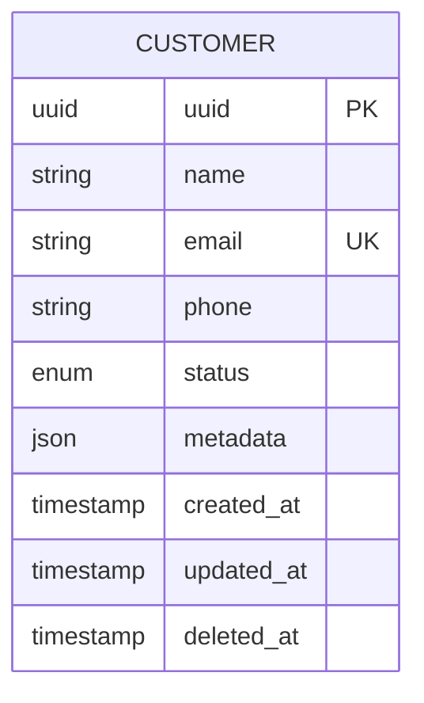

# Customer API

## Overview

The Customer API provides CRUD operations for managing customer records. All endpoints require both API token and Bearer token authentication.



---

## Endpoints

### List Customers

Retrieve paginated list of customers with optional filtering and sorting.

**Endpoint:** `GET /api/v1/customers`

**Authentication:** Bearer token required

#### Query Parameters

| Parameter | Type | Default | Description |
|-----------|------|---------|-------------|
| `page` | integer | 1 | Page number |
| `per_page` | integer | 15 | Items per page (max 100) |
| `search` | string | - | Search in name, email, phone |
| `status` | string | - | Filter by status (active/inactive) |
| `sort_by` | string | created_at | Sort field |
| `sort_direction` | string | desc | Sort direction (asc/desc) |
| `trashed` | string | - | Include deleted (only/with) |

#### Response (200 OK)

```json
{
  "success": true,
  "message": "Customers retrieved successfully",
  "data": [
    {
      "uuid": "550e8400-e29b-41d4-a716-446655440000",
      "name": "John Doe",
      "email": "john@example.com",
      "phone": "+1234567890",
      "status": "active",
      "metadata": {},
      "created_at": "2026-01-01T00:00:00+00:00",
      "updated_at": "2026-01-01T00:00:00+00:00"
    }
  ],
  "meta": {
    "current_page": 1,
    "last_page": 5,
    "per_page": 15,
    "total": 75,
    "from": 1,
    "to": 15
  },
  "links": {
    "first": "/api/v1/customers?page=1",
    "last": "/api/v1/customers?page=5",
    "prev": null,
    "next": "/api/v1/customers?page=2"
  }
}
```

#### Example

```bash
# Basic list
curl -X GET "http://localhost:8000/api/v1/customers" \
  -H "Accept: application/json" \
  -H "x-api-token: your-api-token" \
  -H "Authorization: Bearer your-bearer-token"

# With filters
curl -X GET "http://localhost:8000/api/v1/customers?status=active&search=john&per_page=25" \
  -H "Accept: application/json" \
  -H "x-api-token: your-api-token" \
  -H "Authorization: Bearer your-bearer-token"

# With sorting
curl -X GET "http://localhost:8000/api/v1/customers?sort_by=name&sort_direction=asc" \
  -H "Accept: application/json" \
  -H "x-api-token: your-api-token" \
  -H "Authorization: Bearer your-bearer-token"
```

---

### Create Customer

Create a new customer record.

**Endpoint:** `POST /api/v1/customers`

**Authentication:** Bearer token required

#### Request

```json
{
  "name": "John Doe",
  "email": "john@example.com",
  "phone": "+1234567890",
  "status": "active",
  "metadata": {
    "source": "website",
    "referral": "google"
  }
}
```

| Field | Type | Required | Description |
|-------|------|----------|-------------|
| `name` | string | Yes | Customer name (max 255 chars) |
| `email` | string | Yes | Unique email address |
| `phone` | string | No | Phone number |
| `status` | string | No | Status: active (default) or inactive |
| `metadata` | object | No | Additional custom data |

#### Response (201 Created)

```json
{
  "success": true,
  "message": "Customer created successfully",
  "data": {
    "uuid": "550e8400-e29b-41d4-a716-446655440000",
    "name": "John Doe",
    "email": "john@example.com",
    "phone": "+1234567890",
    "status": "active",
    "metadata": {
      "source": "website",
      "referral": "google"
    },
    "created_at": "2026-01-10T12:00:00+00:00",
    "updated_at": "2026-01-10T12:00:00+00:00"
  }
}
```

#### Error Responses

**409 Conflict** - Email already exists
```json
{
  "success": false,
  "message": "Customer with email john@example.com already exists",
  "error_code": "CUSTOMER_ALREADY_EXISTS"
}
```

**422 Unprocessable** - Validation failed
```json
{
  "success": false,
  "message": "Validation failed",
  "error_code": "VALIDATION_ERROR",
  "errors": {
    "name": ["The name field is required."],
    "email": ["The email must be a valid email address."]
  }
}
```

#### Example

```bash
curl -X POST http://localhost:8000/api/v1/customers \
  -H "Content-Type: application/json" \
  -H "Accept: application/json" \
  -H "x-api-token: your-api-token" \
  -H "Authorization: Bearer your-bearer-token" \
  -d '{
    "name": "John Doe",
    "email": "john@example.com",
    "phone": "+1234567890",
    "status": "active"
  }'
```

---

### Get Customer

Retrieve a single customer by UUID.

**Endpoint:** `GET /api/v1/customers/{uuid}`

**Authentication:** Bearer token required

#### Path Parameters

| Parameter | Type | Description |
|-----------|------|-------------|
| `uuid` | string | Customer UUID |

#### Response (200 OK)

```json
{
  "success": true,
  "message": "Customer retrieved successfully",
  "data": {
    "uuid": "550e8400-e29b-41d4-a716-446655440000",
    "name": "John Doe",
    "email": "john@example.com",
    "phone": "+1234567890",
    "status": "active",
    "metadata": {},
    "created_at": "2026-01-01T00:00:00+00:00",
    "updated_at": "2026-01-01T00:00:00+00:00"
  }
}
```

#### Error Response

**404 Not Found** - Customer not found
```json
{
  "success": false,
  "message": "Customer not found: 550e8400-e29b-41d4-a716-446655440000",
  "error_code": "CUSTOMER_NOT_FOUND"
}
```

#### Example

```bash
curl -X GET http://localhost:8000/api/v1/customers/550e8400-e29b-41d4-a716-446655440000 \
  -H "Accept: application/json" \
  -H "x-api-token: your-api-token" \
  -H "Authorization: Bearer your-bearer-token"
```

---

### Update Customer

Update an existing customer.

**Endpoint:** `PUT /api/v1/customers/{uuid}`

**Authentication:** Bearer token required

#### Path Parameters

| Parameter | Type | Description |
|-----------|------|-------------|
| `uuid` | string | Customer UUID |

#### Request

```json
{
  "name": "John Smith",
  "email": "john.smith@example.com",
  "phone": "+1987654321",
  "status": "inactive"
}
```

| Field | Type | Required | Description |
|-------|------|----------|-------------|
| `name` | string | No | Customer name (max 255 chars) |
| `email` | string | No | Unique email address |
| `phone` | string | No | Phone number |
| `status` | string | No | Status: active or inactive |
| `metadata` | object | No | Additional custom data |

#### Response (200 OK)

```json
{
  "success": true,
  "message": "Customer updated successfully",
  "data": {
    "uuid": "550e8400-e29b-41d4-a716-446655440000",
    "name": "John Smith",
    "email": "john.smith@example.com",
    "phone": "+1987654321",
    "status": "inactive",
    "metadata": {},
    "created_at": "2026-01-01T00:00:00+00:00",
    "updated_at": "2026-01-10T12:00:00+00:00"
  }
}
```

#### Error Responses

**404 Not Found** - Customer not found
```json
{
  "success": false,
  "message": "Customer not found: 550e8400-e29b-41d4-a716-446655440000",
  "error_code": "CUSTOMER_NOT_FOUND"
}
```

**409 Conflict** - Email already exists (when changing email)
```json
{
  "success": false,
  "message": "Customer with email john.smith@example.com already exists",
  "error_code": "CUSTOMER_ALREADY_EXISTS"
}
```

#### Example

```bash
curl -X PUT http://localhost:8000/api/v1/customers/550e8400-e29b-41d4-a716-446655440000 \
  -H "Content-Type: application/json" \
  -H "Accept: application/json" \
  -H "x-api-token: your-api-token" \
  -H "Authorization: Bearer your-bearer-token" \
  -d '{
    "name": "John Smith",
    "status": "inactive"
  }'
```

---

### Delete Customer

Soft delete a customer (can be restored).

**Endpoint:** `DELETE /api/v1/customers/{uuid}`

**Authentication:** Bearer token required

#### Path Parameters

| Parameter | Type | Description |
|-----------|------|-------------|
| `uuid` | string | Customer UUID |

#### Query Parameters

| Parameter | Type | Default | Description |
|-----------|------|---------|-------------|
| `force` | boolean | false | Permanently delete if true |

#### Response (204 No Content)

No response body.

#### Error Response

**404 Not Found** - Customer not found
```json
{
  "success": false,
  "message": "Customer not found: 550e8400-e29b-41d4-a716-446655440000",
  "error_code": "CUSTOMER_NOT_FOUND"
}
```

#### Example

```bash
# Soft delete
curl -X DELETE http://localhost:8000/api/v1/customers/550e8400-e29b-41d4-a716-446655440000 \
  -H "Accept: application/json" \
  -H "x-api-token: your-api-token" \
  -H "Authorization: Bearer your-bearer-token"

# Force delete (permanent)
curl -X DELETE "http://localhost:8000/api/v1/customers/550e8400-e29b-41d4-a716-446655440000?force=true" \
  -H "Accept: application/json" \
  -H "x-api-token: your-api-token" \
  -H "Authorization: Bearer your-bearer-token"
```

---

### Restore Customer

Restore a soft-deleted customer.

**Endpoint:** `POST /api/v1/customers/{uuid}/restore`

**Authentication:** Bearer token required

#### Path Parameters

| Parameter | Type | Description |
|-----------|------|-------------|
| `uuid` | string | Customer UUID |

#### Response (200 OK)

```json
{
  "success": true,
  "message": "Customer restored successfully",
  "data": {
    "uuid": "550e8400-e29b-41d4-a716-446655440000",
    "name": "John Doe",
    "email": "john@example.com",
    "phone": "+1234567890",
    "status": "active",
    "metadata": {},
    "created_at": "2026-01-01T00:00:00+00:00",
    "updated_at": "2026-01-10T12:00:00+00:00"
  }
}
```

#### Error Response

**404 Not Found** - Customer not found in trash
```json
{
  "success": false,
  "message": "Customer not found: 550e8400-e29b-41d4-a716-446655440000",
  "error_code": "CUSTOMER_NOT_FOUND"
}
```

#### Example

```bash
curl -X POST http://localhost:8000/api/v1/customers/550e8400-e29b-41d4-a716-446655440000/restore \
  -H "Accept: application/json" \
  -H "x-api-token: your-api-token" \
  -H "Authorization: Bearer your-bearer-token"
```

---

## Customer Status

| Value | Description |
|-------|-------------|
| `active` | Customer is active and can use services |
| `inactive` | Customer is inactive/suspended |

---

## Filtering Examples

### Search by Name or Email
```
GET /api/v1/customers?search=john
```

### Filter by Status
```
GET /api/v1/customers?status=active
```

### Include Soft-Deleted
```
GET /api/v1/customers?trashed=with
```

### Only Soft-Deleted
```
GET /api/v1/customers?trashed=only
```

### Combined Filters
```
GET /api/v1/customers?status=active&search=john&sort_by=name&sort_direction=asc&per_page=25
```
