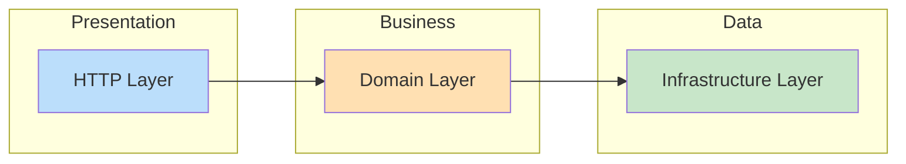
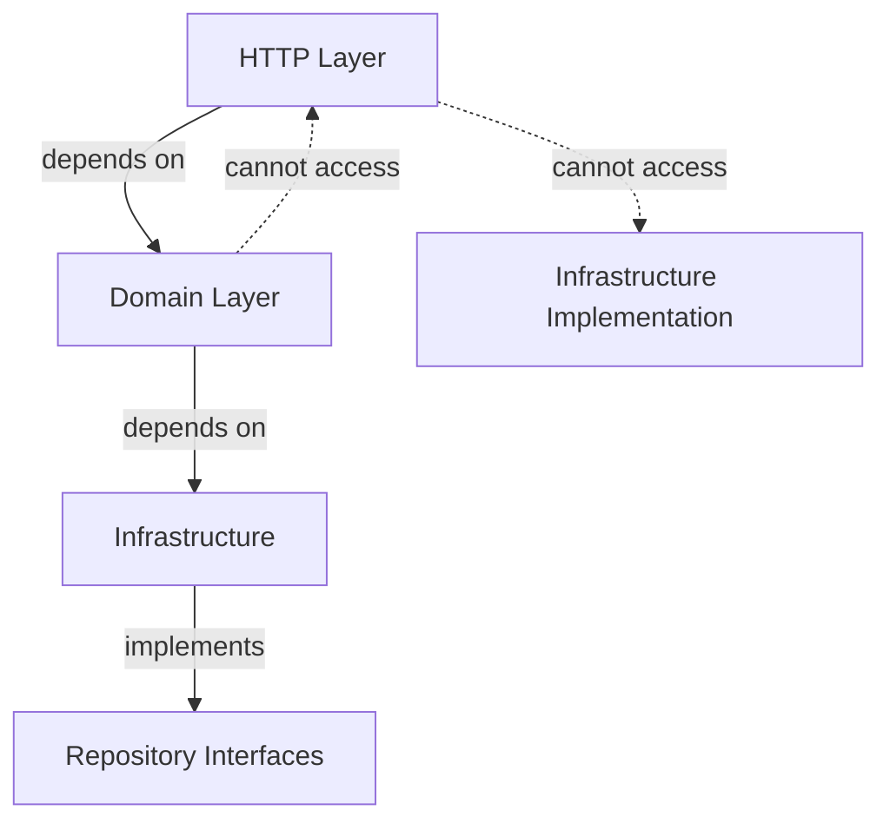

# Layer Structure

## Overview

The application consists of three main layers, each with specific responsibilities and components.



---

## 1. HTTP Layer

**Location:** `app/Http/`

The HTTP layer handles all incoming HTTP requests and outgoing responses. It should contain no business logic.

### Components

#### Controllers
**Location:** `app/Http/Controllers/Api/V1/`

```php
class CustomerController extends Controller
{
    public function __construct(
        private CustomerService $customerService
    ) {}

    public function store(StoreCustomerRequest $request): JsonResponse
    {
        $customer = $this->customerService->create($request->toDto());
        return ApiResponse::resource(new CustomerResource($customer), 'Created', 201);
    }
}
```

**Responsibilities:**
- Receive HTTP requests
- Delegate to domain services
- Return HTTP responses

#### Form Requests
**Location:** `app/Http/Requests/`

```php
class StoreCustomerRequest extends FormRequest
{
    public function rules(): array
    {
        return [
            'name' => ['required', 'string', 'max:255'],
            'email' => ['required', 'email', 'unique:customers,email'],
        ];
    }

    public function toDto(): CustomerData
    {
        return CustomerData::fromArray($this->validated());
    }
}
```

**Responsibilities:**
- Validate incoming data
- Convert to DTOs via `toDto()` method
- Authorization checks

#### Resources
**Location:** `app/Http/Resources/`

```php
class CustomerResource extends JsonResource
{
    public function toArray(Request $request): array
    {
        return [
            'uuid' => $this->uuid,
            'name' => $this->name,
            'email' => $this->email,
            'status' => $this->status->value,
        ];
    }
}
```

**Responsibilities:**
- Transform models for API output
- Control exposed data
- Format response structure

#### Middleware
**Location:** `app/Http/Middleware/`

- `ValidateApiToken` - Validates x-api-token header
- `ForceJsonResponse` - Ensures JSON responses

#### API Responses
**Location:** `app/Http/Responses/`

Standardized response builder for consistent API output.

---

## 2. Domain Layer

**Location:** `app/Domain/`

The domain layer contains all business logic. It's the heart of the application.

### Components

#### Services
**Location:** `app/Domain/{Context}/Services/`

```php
class CustomerService
{
    public function __construct(
        private CustomerRepositoryInterface $repository,
        private CreateCustomerAction $createAction,
    ) {}

    public function create(CustomerData $data): Customer
    {
        return $this->createAction->execute($data);
    }
}
```

**Responsibilities:**
- Orchestrate business operations
- Coordinate multiple actions
- Provide unified interface for controllers

#### Actions
**Location:** `app/Domain/{Context}/Actions/`

```php
class CreateCustomerAction
{
    public function __construct(
        private CustomerRepositoryInterface $repository
    ) {}

    public function execute(CustomerData $data): Customer
    {
        if ($this->repository->existsByEmail($data->email)) {
            throw new CustomerAlreadyExistsException($data->email);
        }

        $customer = $this->repository->create($data->toArray());
        event(new CustomerCreated($customer));

        return $customer;
    }
}
```

**Responsibilities:**
- Single business operation
- Validation rules
- Event dispatching
- Exception throwing

#### DTOs (Data Transfer Objects)
**Location:** `app/Domain/{Context}/DTOs/`

```php
readonly class CustomerData
{
    public function __construct(
        public string $name,
        public string $email,
        public ?string $phone = null,
        public CustomerStatus $status = CustomerStatus::Active,
    ) {}

    public static function fromArray(array $data): self
    {
        return new self(...);
    }

    public function toArray(): array
    {
        return [...];
    }
}
```

**Responsibilities:**
- Type-safe data containers
- Immutable (readonly)
- Layer boundary crossing

#### Events
**Location:** `app/Domain/{Context}/Events/`

```php
class CustomerCreated
{
    public function __construct(
        public Customer $customer
    ) {}
}
```

**Responsibilities:**
- Signal domain occurrences
- Enable loose coupling
- Trigger side effects

#### Exceptions
**Location:** `app/Domain/{Context}/Exceptions/`

```php
class CustomerNotFoundException extends DomainException
{
    public function __construct(int|string $identifier)
    {
        parent::__construct(
            message: "Customer not found: {$identifier}",
            errorCode: 'CUSTOMER_NOT_FOUND',
            code: 404
        );
    }
}
```

**Responsibilities:**
- Domain-specific errors
- HTTP status code mapping
- Error code for API clients

#### Enums
**Location:** `app/Domain/{Context}/Enums/`

```php
enum CustomerStatus: string
{
    case Active = 'active';
    case Inactive = 'inactive';

    public function label(): string { ... }
}
```

#### Policies
**Location:** `app/Domain/{Context}/Policies/`

Authorization logic for domain entities.

---

## 3. Infrastructure Layer

**Location:** `app/Infrastructure/`

The infrastructure layer handles data persistence and external services.

### Components

#### Repository Interfaces
**Location:** `app/Infrastructure/Repositories/Contracts/`

```php
interface CustomerRepositoryInterface extends BaseRepositoryInterface
{
    public function findByEmail(string $email): ?Customer;
    public function existsByEmail(string $email): bool;
}
```

**Note:** Interfaces could be in Domain layer for stricter DDD, but are placed here for practical reasons.

#### Repository Implementations
**Location:** `app/Infrastructure/Repositories/Eloquent/`

```php
class CustomerRepository extends BaseRepository implements CustomerRepositoryInterface
{
    protected function resolveModel(): Model
    {
        return new Customer();
    }

    public function findByEmail(string $email): ?Customer
    {
        return $this->model->where('email', $email)->first();
    }
}
```

**Responsibilities:**
- Implement data access
- Eloquent queries
- Filter/sort logic

#### Models
**Location:** `app/Infrastructure/Models/`

```php
class Customer extends Model
{
    use HasFactory, HasUuid, SoftDeletes;

    protected $fillable = ['uuid', 'name', 'email', ...];
    protected $casts = ['status' => CustomerStatus::class];
}
```

**Responsibilities:**
- Eloquent ORM mapping
- Relationships
- Scopes
- Attribute casting

#### Persistence Traits
**Location:** `app/Infrastructure/Persistence/Traits/`

- `Filterable` - Dynamic query filtering
- `Sortable` - Query sorting
- `Searchable` - Full-text search

---

## Layer Dependencies



### Allowed Dependencies:
- HTTP → Domain ✅
- Domain → Infrastructure Contracts ✅
- Infrastructure implements Contracts ✅

### Forbidden Dependencies:
- Domain → HTTP ❌
- HTTP → Infrastructure directly ❌
- Infrastructure → Domain ❌
