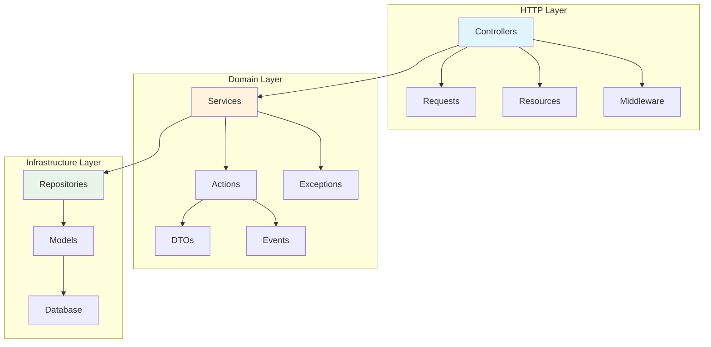
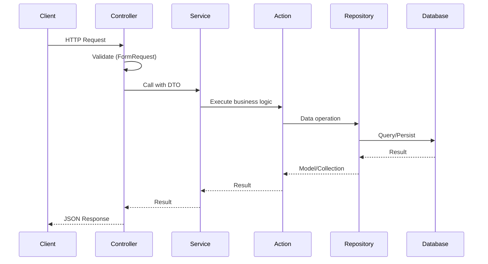

# Architecture Overview

## Introduction

This application follows **Domain-Driven Design (DDD)** principles with a layered architecture that separates concerns and promotes maintainability, testability, and scalability.

## High-Level Architecture

## Architecture Principles

### 1. Separation of Concerns
Each layer has a specific responsibility:
- **HTTP Layer**: Handles HTTP requests/responses
- **Domain Layer**: Contains business logic
- **Infrastructure Layer**: Handles data persistence

### 2. Dependency Inversion
- High-level modules don't depend on low-level modules
- Both depend on abstractions (interfaces)
- Repository interfaces in Domain, implementations in Infrastructure

### 3. Single Responsibility
- Each class has one reason to change
- Actions perform one business operation
- DTOs carry data between layers

## Layer Communication

## Bounded Contexts

The application is organized into bounded contexts (domains):

| Context | Purpose | Location |
|---------|---------|----------|
| **Auth** | Authentication & Authorization | `app/Domain/Auth/` |
| **Customer** | Customer management | `app/Domain/Customer/` |
| **Shared** | Cross-cutting concerns | `app/Domain/Shared/` |

## Key Design Decisions

### Why DDD?
- Clear separation between business logic and infrastructure
- Easier to understand and maintain
- Facilitates team collaboration
- Enables independent domain evolution

### Why Repository Pattern?
- Abstracts data access logic
- Makes domain layer database-agnostic
- Simplifies testing with mock repositories
- Single source of truth for queries

### Why Action Classes?
- Single responsibility for each business operation
- Easy to test in isolation
- Clear naming indicates purpose
- Reusable across controllers

### Why DTOs?
- Type-safe data transfer
- Decouples layers
- Self-documenting data structures
- Immutable by design (readonly)

## Next Steps

- [Layer Structure](./layers.md) - Detailed explanation of each layer
- [Design Patterns](./patterns.md) - Patterns used in the codebase
- [Directory Structure](./directory-structure.md) - File organization
