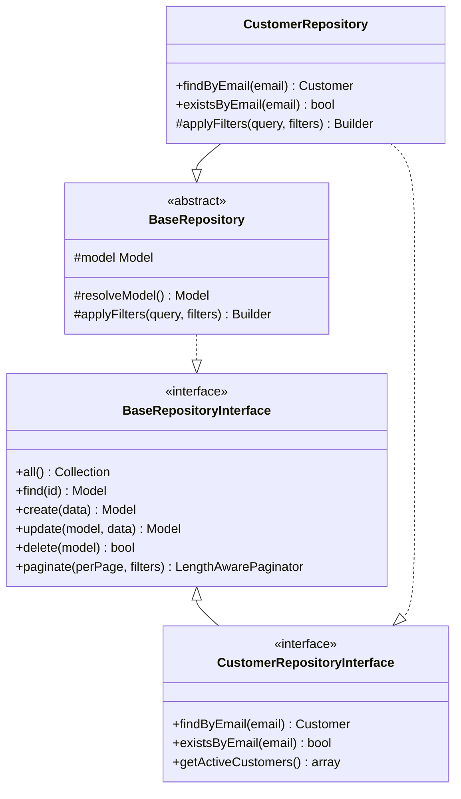
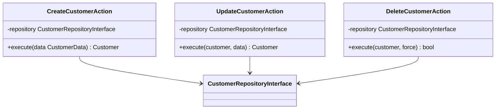
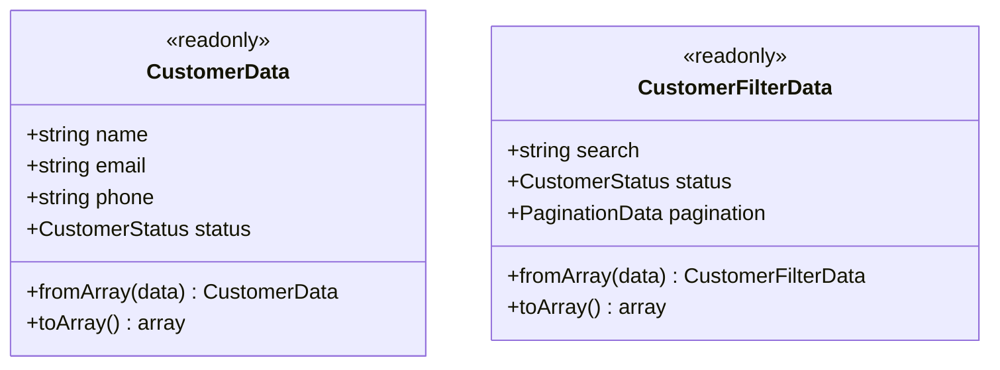
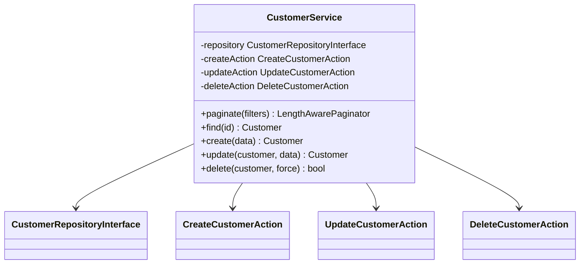
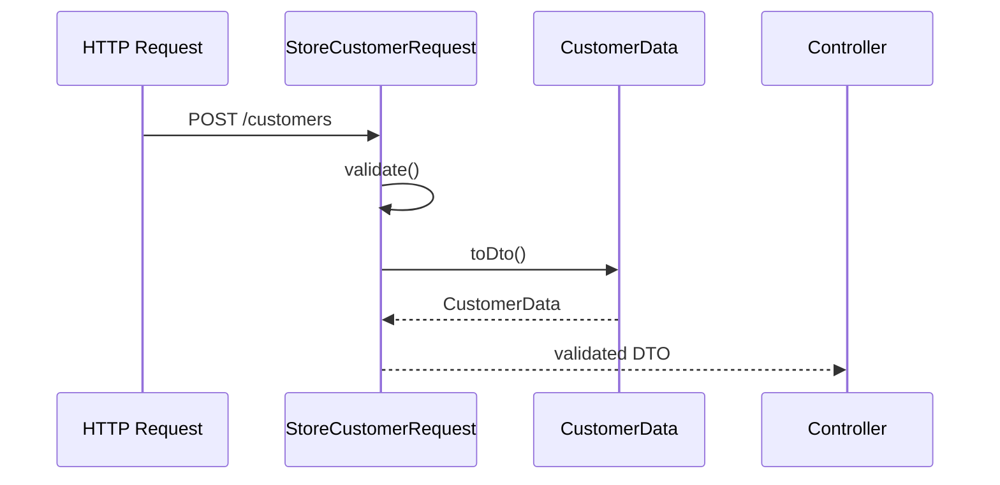
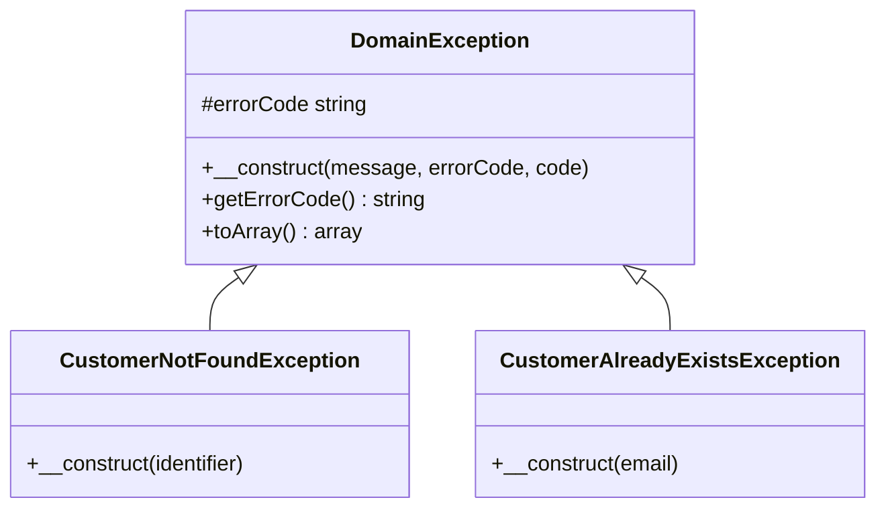

# Design Patterns

## Overview

This document describes the design patterns used throughout the application and how to implement them correctly.

---

## 1. Repository Pattern

### Purpose
Abstracts data access logic, providing a collection-like interface for accessing domain objects.

### Structure



### Implementation Example

```php
// Contract (Interface)
interface CustomerRepositoryInterface extends BaseRepositoryInterface
{
    public function findByEmail(string $email): ?Customer;
    public function existsByEmail(string $email): bool;
}

// Implementation
class CustomerRepository extends BaseRepository implements CustomerRepositoryInterface
{
    protected function resolveModel(): Model
    {
        return new Customer();
    }

    public function findByEmail(string $email): ?Customer
    {
        return $this->model->where('email', $email)->first();
    }

    public function existsByEmail(string $email): bool
    {
        return $this->model->where('email', $email)->exists();
    }
}
```

### Binding (Service Provider)

```php
// app/Providers/RepositoryServiceProvider.php
$this->app->bind(
    CustomerRepositoryInterface::class,
    CustomerRepository::class
);
```

---

## 2. Action Pattern

### Purpose
Encapsulates a single business operation in a dedicated class, promoting single responsibility.

### Structure



### Implementation Example

```php
class CreateCustomerAction
{
    public function __construct(
        private CustomerRepositoryInterface $repository
    ) {}

    public function execute(CustomerData $data): Customer
    {
        // 1. Validate business rules
        if ($this->repository->existsByEmail($data->email)) {
            throw new CustomerAlreadyExistsException($data->email);
        }

        // 2. Perform operation
        $customer = $this->repository->create($data->toArray());

        // 3. Dispatch events
        event(new CustomerCreated($customer));

        // 4. Return result
        return $customer;
    }
}
```

### When to Create an Action
- Operation has business logic beyond simple CRUD
- Operation needs to be reused
- Operation dispatches events
- Operation has validation rules

---

## 3. DTO Pattern (Data Transfer Object)

### Purpose
Carries data between layers with type safety and immutability.

### Structure



### Implementation Example

```php
readonly class CustomerData
{
    public function __construct(
        public string $name,
        public string $email,
        public ?string $phone = null,
        public CustomerStatus $status = CustomerStatus::Active,
        public array $metadata = [],
    ) {}

    public static function fromArray(array $data): self
    {
        return new self(
            name: $data['name'],
            email: $data['email'],
            phone: $data['phone'] ?? null,
            status: isset($data['status'])
                ? CustomerStatus::from($data['status'])
                : CustomerStatus::Active,
            metadata: $data['metadata'] ?? [],
        );
    }

    public function toArray(): array
    {
        return [
            'name' => $this->name,
            'email' => $this->email,
            'phone' => $this->phone,
            'status' => $this->status->value,
            'metadata' => $this->metadata,
        ];
    }
}
```

### DTO Conventions
- Use `readonly` class modifier
- Implement `fromArray()` static factory
- Implement `toArray()` for persistence
- Use constructor property promotion

---

## 4. Service Pattern

### Purpose
Orchestrates multiple actions and provides a unified interface for controllers.

### Structure



### Implementation Example

```php
class CustomerService
{
    public function __construct(
        private CustomerRepositoryInterface $repository,
        private CreateCustomerAction $createAction,
        private UpdateCustomerAction $updateAction,
        private DeleteCustomerAction $deleteAction,
    ) {}

    public function paginate(CustomerFilterData $filters): LengthAwarePaginator
    {
        return $this->repository->paginate(
            perPage: $filters->pagination?->perPage ?? 15,
            filters: $filters->toArray()
        );
    }

    public function create(CustomerData $data): Customer
    {
        return $this->createAction->execute($data);
    }

    public function find(int $id): Customer
    {
        $customer = $this->repository->find($id);

        if (!$customer) {
            throw new CustomerNotFoundException($id);
        }

        return $customer;
    }
}
```

---

## 5. Form Request to DTO Pattern

### Purpose
Bridges HTTP layer validation with domain layer data structures.

### Flow



### Implementation

```php
class StoreCustomerRequest extends FormRequest
{
    public function rules(): array
    {
        return [
            'name' => ['required', 'string', 'max:255'],
            'email' => ['required', 'email', 'unique:customers'],
        ];
    }

    public function toDto(): CustomerData
    {
        return CustomerData::fromArray($this->validated());
    }
}

// Usage in Controller
public function store(StoreCustomerRequest $request): JsonResponse
{
    $customer = $this->service->create($request->toDto());
    // ...
}
```

---

## 6. Domain Exception Pattern

### Purpose
Provides domain-specific errors with HTTP status codes and error codes.

### Structure



### Implementation

```php
// Base Exception
class DomainException extends Exception
{
    protected string $errorCode;

    public function __construct(
        string $message,
        string $errorCode = 'DOMAIN_ERROR',
        int $code = 400,
    ) {
        parent::__construct($message, $code);
        $this->errorCode = $errorCode;
    }

    public function toArray(): array
    {
        return [
            'error_code' => $this->errorCode,
            'message' => $this->getMessage(),
        ];
    }
}

// Specific Exception
class CustomerNotFoundException extends DomainException
{
    public function __construct(int|string $identifier)
    {
        parent::__construct(
            message: "Customer not found: {$identifier}",
            errorCode: 'CUSTOMER_NOT_FOUND',
            code: 404
        );
    }
}
```

---

## Pattern Summary

| Pattern | Location | Purpose |
|---------|----------|---------|
| Repository | `Infrastructure/Repositories/` | Data access abstraction |
| Action | `Domain/{Context}/Actions/` | Single business operation |
| DTO | `Domain/{Context}/DTOs/` | Type-safe data transfer |
| Service | `Domain/{Context}/Services/` | Operation orchestration |
| Form Request | `Http/Requests/` | Validation + DTO conversion |
| Domain Exception | `Domain/{Context}/Exceptions/` | Domain-specific errors |
