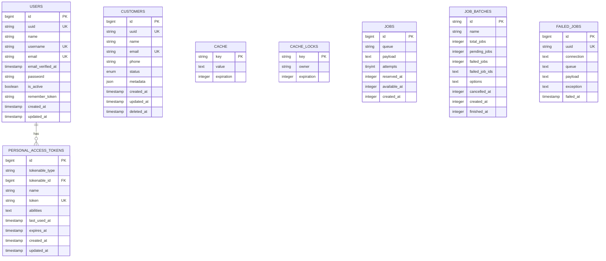

# Database Documentation

## Overview

The application uses PostgreSQL as the primary database with Laravel Eloquent ORM for data access.

---

## Entity Relationship Diagram



---

## Tables

### users

Primary user table for authentication.

| Column | Type | Nullable | Default | Description |
|--------|------|----------|---------|-------------|
| `id` | bigint | No | auto | Primary key |
| `uuid` | string(36) | No | - | Public identifier |
| `name` | string(255) | No | - | Full name |
| `username` | string(255) | No | - | Unique username |
| `email` | string(255) | No | - | Unique email |
| `email_verified_at` | timestamp | Yes | null | Verification time |
| `password` | string(255) | No | - | Hashed password |
| `is_active` | boolean | No | true | Account status |
| `remember_token` | string(100) | Yes | null | Session token |
| `created_at` | timestamp | Yes | null | Created time |
| `updated_at` | timestamp | Yes | null | Updated time |

**Indexes:**
- Primary: `id`
- Unique: `uuid`, `username`, `email`

---

### customers

Customer records with soft deletes.

| Column | Type | Nullable | Default | Description |
|--------|------|----------|---------|-------------|
| `id` | bigint | No | auto | Primary key |
| `uuid` | string(36) | No | - | Public identifier |
| `name` | string(255) | No | - | Customer name |
| `email` | string(255) | No | - | Unique email |
| `phone` | string(20) | Yes | null | Phone number |
| `status` | enum | No | active | active/inactive |
| `metadata` | json | Yes | null | Custom data |
| `created_at` | timestamp | Yes | null | Created time |
| `updated_at` | timestamp | Yes | null | Updated time |
| `deleted_at` | timestamp | Yes | null | Soft delete time |

**Indexes:**
- Primary: `id`
- Unique: `uuid`, `email`
- Index: `status`, `deleted_at`

---

### personal_access_tokens

Laravel Sanctum tokens for API authentication.

| Column | Type | Nullable | Default | Description |
|--------|------|----------|---------|-------------|
| `id` | bigint | No | auto | Primary key |
| `tokenable_type` | string(255) | No | - | Model class |
| `tokenable_id` | bigint | No | - | Model ID |
| `name` | string(255) | No | - | Token name/device |
| `token` | string(64) | No | - | Hashed token |
| `abilities` | text | Yes | null | JSON abilities |
| `last_used_at` | timestamp | Yes | null | Last use time |
| `expires_at` | timestamp | Yes | null | Expiration time |
| `created_at` | timestamp | Yes | null | Created time |
| `updated_at` | timestamp | Yes | null | Updated time |

**Indexes:**
- Primary: `id`
- Unique: `token`
- Index: `tokenable_type`, `tokenable_id`

---

## Migrations

Migrations are located in `database/migrations/`:

| File | Description |
|------|-------------|
| `0001_01_01_000000_create_users_table.php` | Users and sessions |
| `0001_01_01_000001_create_cache_table.php` | Cache and locks |
| `0001_01_01_000002_create_jobs_table.php` | Queue jobs |
| `2024_01_01_000001_create_customers_table.php` | Customers |

### Running Migrations

```bash
# Run all migrations
php artisan migrate

# Rollback last batch
php artisan migrate:rollback

# Fresh install (drops all tables)
php artisan migrate:fresh

# Fresh with seeders
php artisan migrate:fresh --seed
```

---

## Seeders

Located in `database/seeders/`:

### DatabaseSeeder

Main seeder that calls other seeders.

```php
// database/seeders/DatabaseSeeder.php
public function run(): void
{
    $this->call([
        UserSeeder::class,
    ]);
}
```

### UserSeeder

Creates default admin user.

```php
// database/seeders/UserSeeder.php
User::factory()->create([
    'name' => 'Admin User',
    'username' => 'admin',
    'email' => 'admin@example.com',
    'password' => Hash::make('password'),
    'is_active' => true,
]);
```

### Running Seeders

```bash
# Run all seeders
php artisan db:seed

# Run specific seeder
php artisan db:seed --class=UserSeeder
```

---

## Factories

Located in `database/factories/`:

### UserFactory

```php
User::factory()->create();                    // Single user
User::factory()->count(10)->create();         // 10 users
User::factory()->unverified()->create();      // Unverified email
```

### CustomerFactory

```php
Customer::factory()->create();                // Single customer
Customer::factory()->count(50)->create();     // 50 customers
Customer::factory()->inactive()->create();   // Inactive status
Customer::factory()->trashed()->create();    // Soft deleted
```

---

## Query Patterns

### UUID Lookups

Always use UUID for public-facing lookups:

```php
// Good - uses UUID
$customer = Customer::where('uuid', $uuid)->firstOrFail();

// Avoid - exposes internal ID
$customer = Customer::find($id);
```

### Soft Deletes

```php
// Active customers only (default)
Customer::all();

// Include trashed
Customer::withTrashed()->get();

// Only trashed
Customer::onlyTrashed()->get();

// Restore
$customer->restore();

// Force delete
$customer->forceDelete();
```

### Filtering with Traits

```php
// Using Filterable trait
$query = Customer::query()
    ->filter(['status' => 'active', 'search' => 'john'])
    ->sortable('name', 'asc')
    ->paginate(15);
```

---

## Database Configuration

### Environment Variables

```env
DB_CONNECTION=pgsql
DB_HOST=127.0.0.1
DB_PORT=5432
DB_DATABASE=your_database
DB_USERNAME=your_username
DB_PASSWORD=your_password
```

### PostgreSQL Setup

```bash
# Create database
createdb your_database

# Create user
createuser -P your_username

# Grant privileges
psql -c "GRANT ALL PRIVILEGES ON DATABASE your_database TO your_username;"
```
