# Application Flows

## Overview

This document illustrates the key application flows with sequence diagrams showing how requests are processed through the system layers.

---

## Request Lifecycle

### General Request Flow

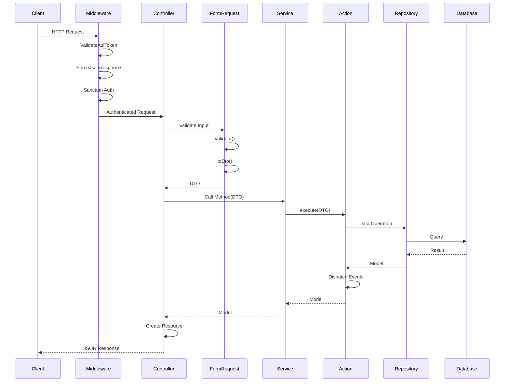

---

## Authentication Flows

### Login Flow

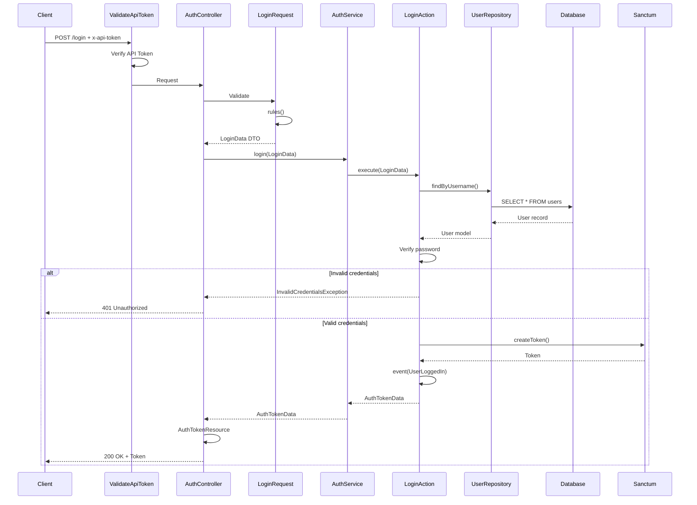

### Token Validation Flow

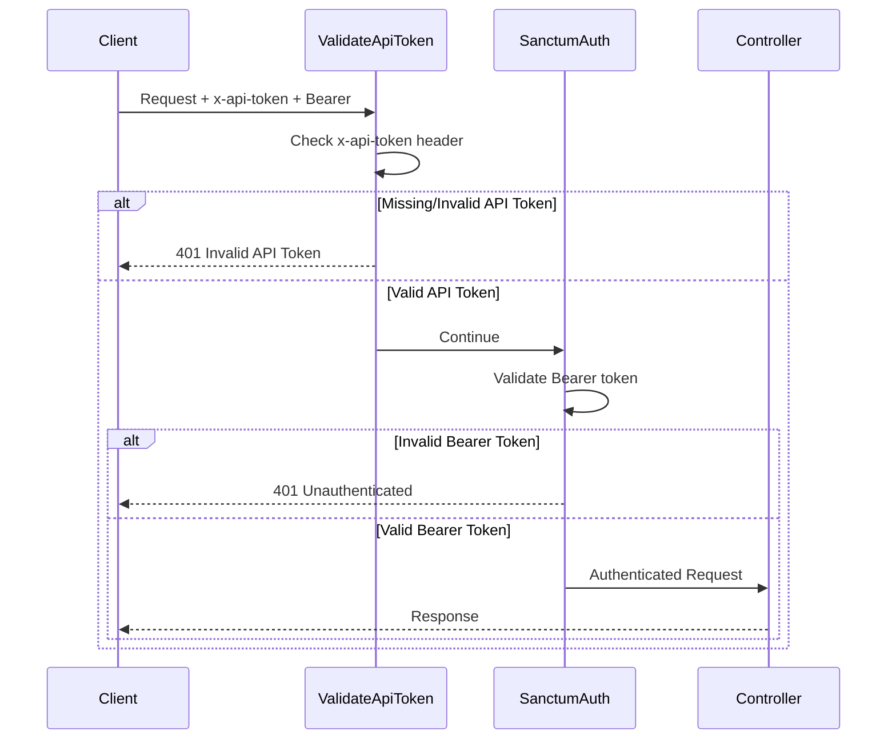

### Logout Flow

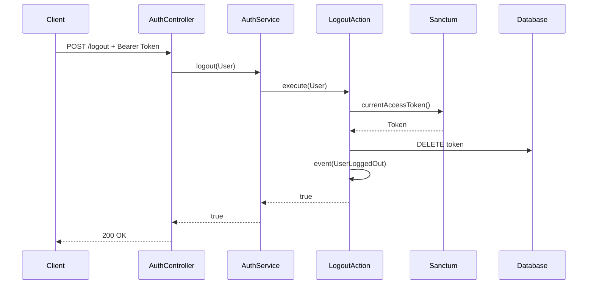

---

## Customer CRUD Flows

### Create Customer Flow

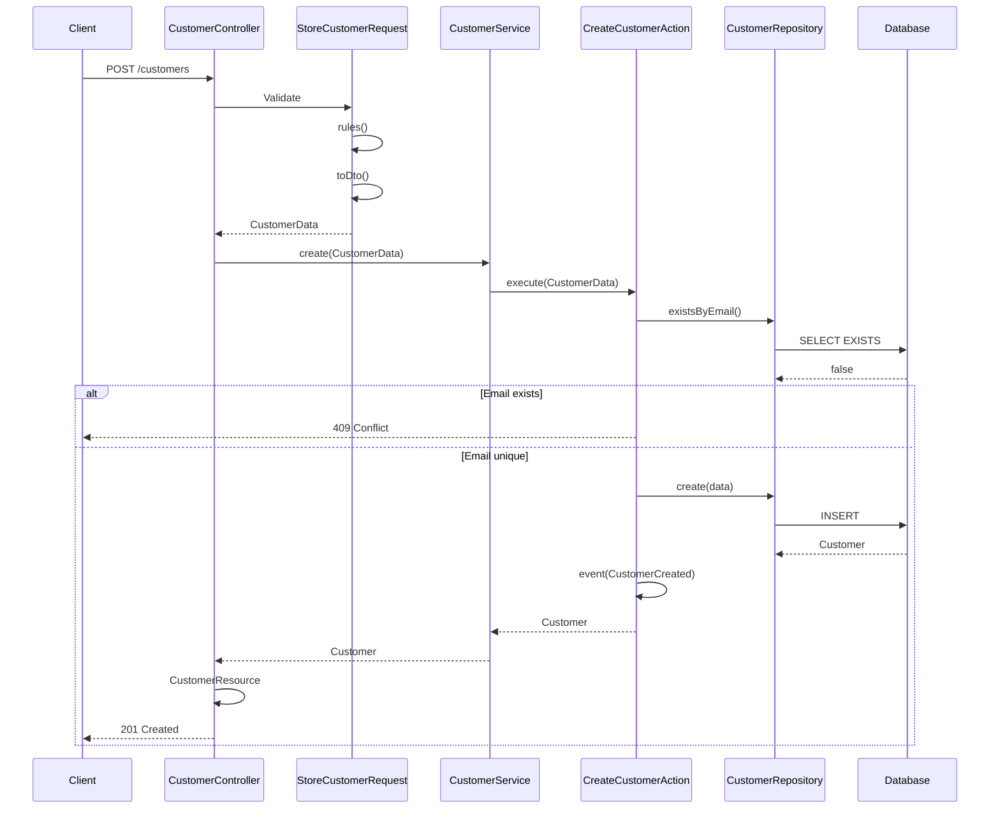

### Update Customer Flow

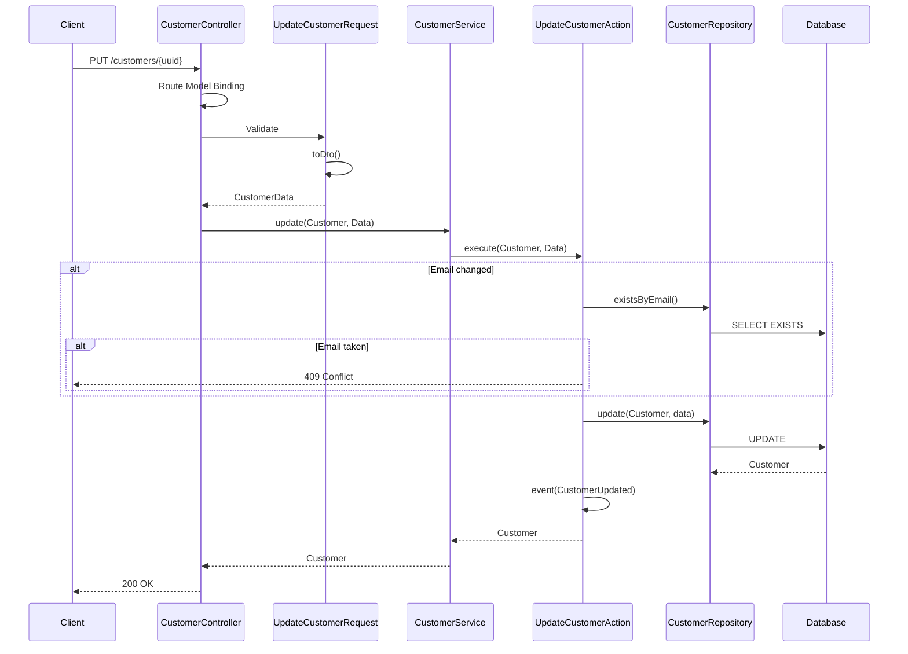

### Delete Customer Flow

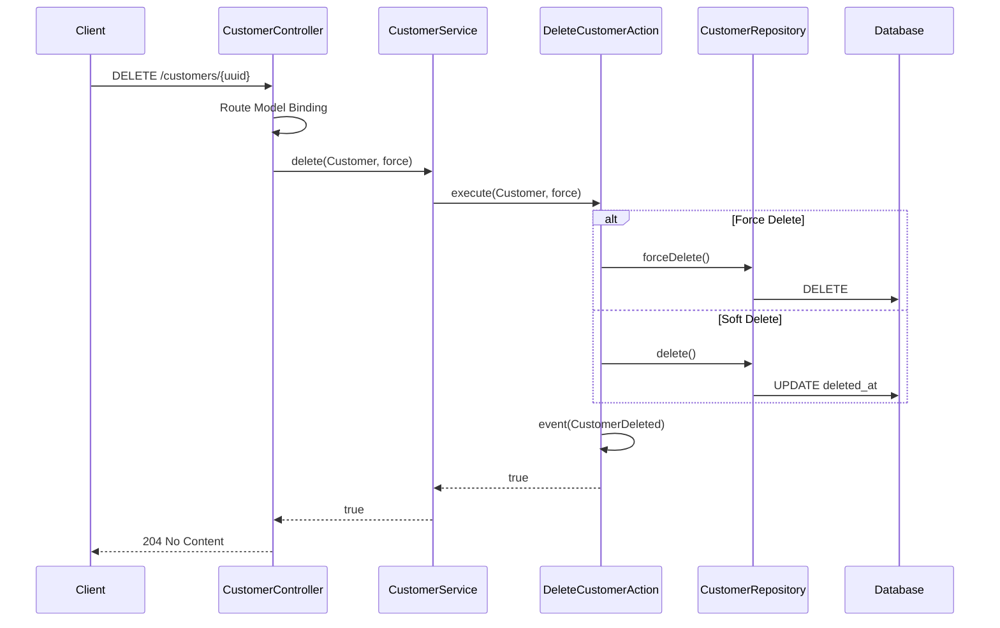

### List Customers Flow

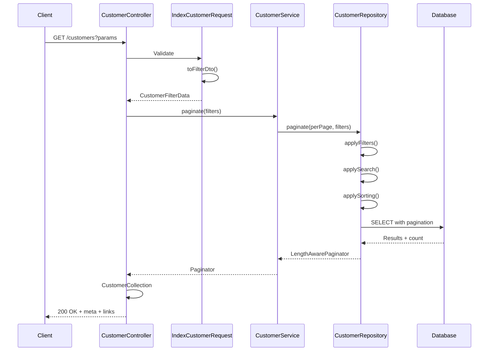

---

## Event Flow

### Event Dispatching

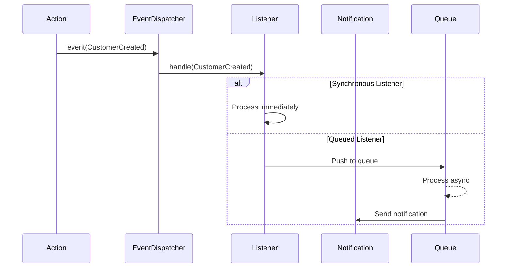

### Available Events

| Event | Trigger | Listeners |
|-------|---------|-----------|
| `UserLoggedIn` | Successful login | Logging, analytics |
| `UserLoggedOut` | Logout | Logging |
| `CustomerCreated` | New customer | Welcome notification |
| `CustomerUpdated` | Customer update | Sync, logging |
| `CustomerDeleted` | Customer delete | Cleanup, archive |

---

## Error Handling Flow

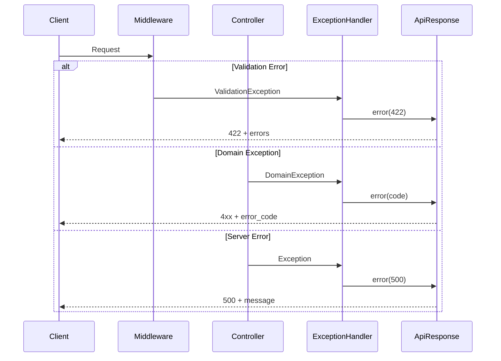

---

## Middleware Stack

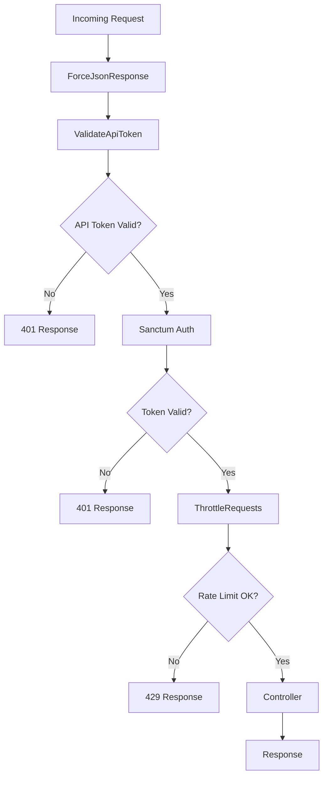
